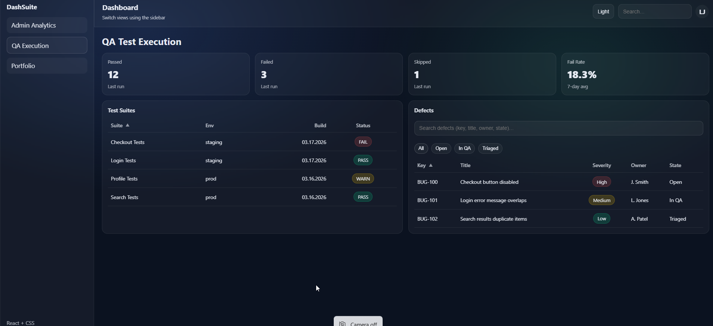
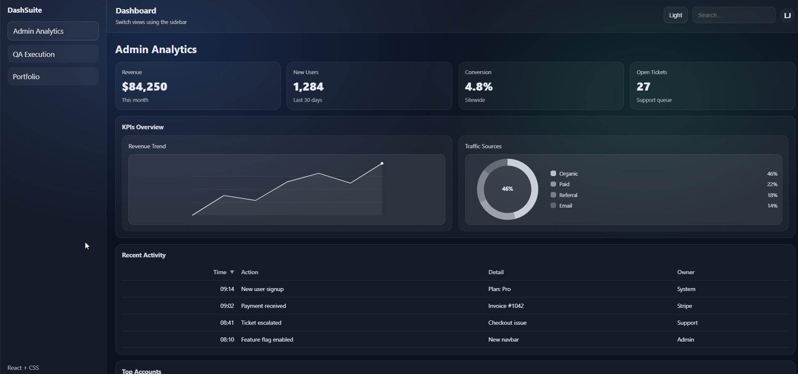
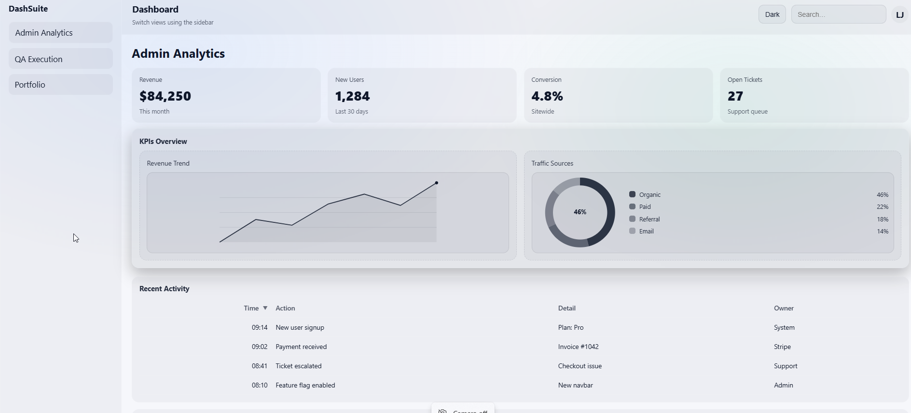

# React Dashboard Suite

A production-ready, multi-view React dashboard built with reusable architecture, client-focused UI patterns, and scalable structure.

🔗 Live Demo: https://react-dashboard-suite.vercel.app  
🔗 GitHub Repo: https://github.com/justjones/react-dashboard-suite

---

## 🚀 Overview

This dashboard suite demonstrates a scalable frontend architecture suitable for:

- Business analytics dashboards
- Admin panels
- QA reporting tools
- Client data visualization portals
- Internal operations dashboards

Built with performance, reusability, and maintainability in mind.

---

## ✨ Features

- ✅ Multi-page dashboard routing (QA / Admin / Portfolio views)
- ✅ Reusable DataTable abstraction
- ✅ Sorting (including custom domain-based ordering)
- ✅ Filtering + Search pipeline
- ✅ Skeleton loading states
- ✅ Theme toggle (Dark / Light mode)
- ✅ Lightweight SVG charts (Donut + MiniLine)
- ✅ Responsive layout (mobile-friendly)
- ✅ Clean folder architecture
- ✅ Production deployment on Vercel

---

## 🏗 Architecture
src/
├── pages/ # Dashboard views
├── components/
│ ├── dashboard/ # Core dashboard components
│ ├── ui/ # Reusable UI primitives
│ └── charts/ # SVG data visualizations
├── data/ # Mock data sources
├── hooks/ # Custom React hooks
├── utils/ # Shared utilities (e.g., sorting logic)
└── styles/ # Modular CSS structure


Shared logic such as sorting behavior is abstracted into reusable utilities to avoid duplication and improve scalability.

---

## 🛠 Tech Stack

- React
- React Router
- Vite
- Modern CSS (modular structure)
- SVG-based charts
- Vercel (deployment)

---

## 💡 Why This Matters

This project demonstrates:

- Thoughtful component abstraction
- Clean separation of concerns
- UX polish (micro-interactions + loading states)
- Reusable dashboard foundation for client customization

This architecture can easily be extended to connect to real APIs, authentication systems, and live data sources.

---

## 🧩 Potential Enhancements

- API integration (REST / GraphQL)
- Authentication & role-based access
- Pagination / server-side filtering
- Export to CSV / PDF
- Chart tooltips & animation enhancements
- Backend integration (Node / Python)

---

## 📦 Local Development

```bash
npm install
npm run dev


npm run build
npm run preview

👩‍💻 About

Manual QA Engineer transitioning into automation and frontend development, focused on building structured, scalable UI systems for real-world applications.

Available for freelance dashboard development and UI customization projects.

## 📸 Screenshots



